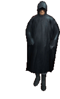

# greetings! 

<div align="center">
    
</div>

# skill *(issue)* 🗿

<table style="margin-left: auto; margin-right: auto;" markdown="1">
    <tr>
        <th style="text-align: left;">stack</th>
        <th style="text-align: center;">statistics</th>
        <th style="text-align: right;">snek</th>
    <tr/>
  <tr>
    <td>
        <ul>
            <li>
                
            </li>
            <li>
                
            </li>
            <li>
                
            </li>
            <li>
                
            </li>
        </ul>
    </td>        
    <td>
        
    </td>       
    <td>
        
    </td>
  </tr>
</table>


# wisdom 

```
 _________________________________________
/ if practice makes perfect, and nobody's \
\ perfect, why practice?                  /
 -----------------------------------------
        \   ^__^
         \  (oo)\_______
            (__)\       )\/\
                ||----w |
                ||     ||
```

<details>
  <summary> my secret :3</summary>
  ⬆️ ⬆️ ⬇️ ⬇️ ⬅️ ➡️ ⬅️ ➡️ 🅱️ 🅰️ 
</details>
